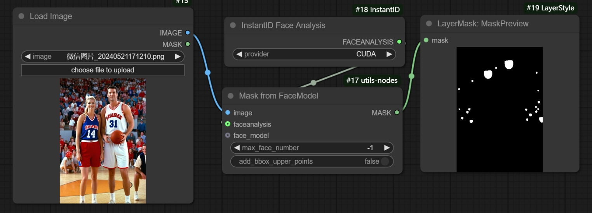
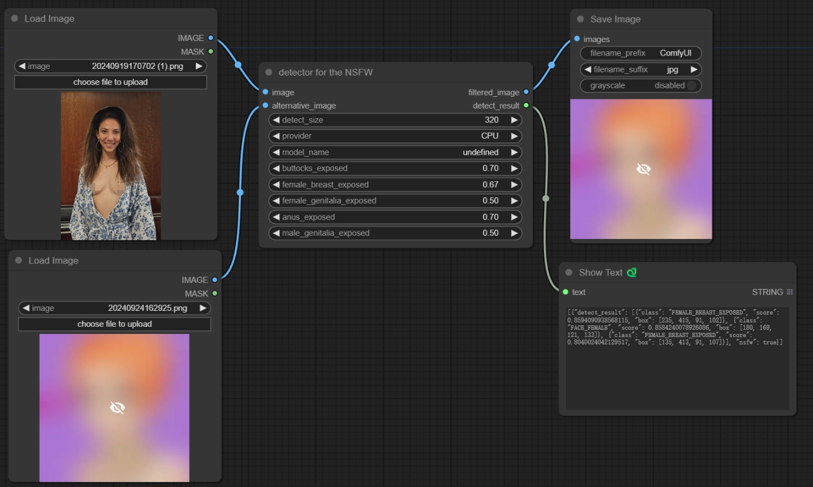
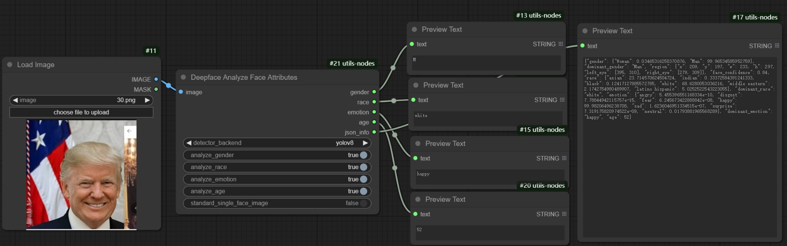

# Some Utils for ComfyUI

## LoadImageWithSwitch
Modified the official LoadImage node by adding a switch. When turned off, it will not load the image.

## LoadImageMaskWithSwitch
Modified the official LoadImageMask node by adding a switch. When turned off, it will not load the image to mask.

## LoadImageWithoutListDir
When there are a lot of images in the input directory, loading image with `os.listdir` can be slow. This node avoids using `os.listdir` to improve performance.

## LoadImageMaskWithoutListDir
When there are a lot of images in the input directory, loading image as Mask with `os.listdir` can be slow. This node avoids using `os.listdir` to improve performance.

## ImageCompositeMaskedWithSwitch
Modified the official ImageCompositeMasked node by adding a switch. When turned off, it will return the destination image directly.

## ImageCompositeMaskedOneByOne
Modified the official ImageCompositeMasked node to process images one by one, instead of processing an entire batch at once. In video scenarios, processing in a batch may require a significant amount of memory, but this method helps reduce memory usage.

## ImageBatchOneOrMore
This node can input one or more images, the limit is six. It expands the functionality of the official ImageBatch node from two to multiple images.

## ImageConcatenateOfUtils

This node, ImageConcatenateOfUtils, is an extension of the original [ImageConcatenate](https://github.com/kijai/ComfyUI-KJNodes) node developed by @kijai.

### Features
- **Upscale**: This extension adds the capability to upscale images.
- **Check**: Additional functionality for checking the second image empty or not.

### Original node
The original ImageConcatenate node can be found [here](https://github.com/kijai/ComfyUI-KJNodes).
Special thanks to @kijai for their contribution to the initial version.

## ColorCorrectOfUtils
This node, ColorCorrectOfUtils, is an extension of the original [ColorCorrect](https://github.com/EllangoK/ComfyUI-post-processing-nodes/blob/master/post_processing/color_correct.py) node developed by @EllangoK. Added the channels of red, green, and blue adjustment functionalities.

## ImagesConcanateToGrid
This node is designed to concatenate the input one batch images to a grid. It can concatenate images in the horizontal or vertical direction.

## VolcanoOutpainting
This node is designed to outpaint the input image using the Volcano engine. 
To use this node, you must get your free API key from Volcano engine:
   - Visit [Volcano engine](https://console.volcengine.com/)
   - Log in with your Volcano engine account
   - Click on "访问控制" or go to [settings](https://console.volcengine.com/iam/keymanage)
   - Create a new API key
   - Copy the API key for use in the node's input
## VolcanoImageEdit
This node is designed to edit the input image using the Volcano engine.

## VolcanoArkImageEdit
This node is designed to edit images using the volcano Ark API, supporting multiple input images and various image sizes and aspect ratios.

## ModifyTextGender
This node adjusts the text to describe the gender based on the input. If the gender input is 'M', the text will be adjusted to describe as male; if the gender input is 'F', it will be adjusted to describe as female.

## GeminiPromptEnhance
This node is designed to enhance the text description of the image, using the latest Gemini 2.0 flash model. It can add quality descriptors, lighting descriptions, scene descriptions, and skin descriptions to the text. and according to the gender input, can modify the content about gender.

To use this node, you must get your free API key from Google AI Studio:
   - Visit [Google AI Studio](https://aistudio.google.com/prompts/new_chat)
   - Log in with your Google account
   - Click on "Get API key" or go to settings
   - Create a new API key
   - Copy the API key for use in the node's input or gemini_config.json

this code is original from https://github.com/ShmuelRonen/ComfyUI-Gemini_Flash_2.0_Exp, added new features. thanks to @ShmuelRonen.

## GenderControlOutput
This node determines the output based on the input gender. If the gender input is 'M', it will output male-specific text, float, and integer values. If the gender input is 'F', it will output female-specific text, float, and integer values.

## BooleanControlOutput
This node outputs different values based on a boolean input. If the boolean input is True, it will output the values of true_text, true_float, true_int, True, and False. If the boolean input is False, it will output the values of false_text, false_float, false_int, False, and True.

## SplitMask
This node splits one mask into two masks of the same size according to the area of the submasks. If there are more than two areas, it will select the two largest submasks.

## MaskFastGrow
This node is designed for growing masks quickly. When using the official or other mask growth nodes, the speed slows down significantly with large grow values, such as above 20. In contrast, this node maintains consistent speed regardless of the grow value.

## MaskFromFaceModel
Generates a mask from the face model of the Reactor face swap node. The mask covers the facial area below the eyes, excluding the forehead. Enabling add_bbox_upper_points provides a rough approximation but lacks precision. If the forehead is essential for your application, consider using a different mask or adjusting the generated mask as needed.



## MaskAutoSelector
Check the three input masks. If any are available, return the first. If none are available, raise an exception.

## MaskCoverFourCorners
Generates a mask by covering the selected corners with circular edges. This mask can be used as an attention mask to remove watermarks from the corners.

## MaskofCenter
Generates a mask by covering the center of the image with a circular edge. This mask can be used as an attention mask, then model can focus on the center of the image.

## MaskAreaComparison
This node compares the area of the mask with the threshold. If the area is greater than the threshold, it will return True; otherwise, it will return False.


## CheckpointLoaderSimpleWithSwitch
Enhanced the official LoadCheckpoint node by integrating three switches. Each switch controls whether a specific component is loaded. When a switch is turned off, the corresponding component will not be loaded. if you use the extra vae and close the model's vae loading, that will save memory.

## ImageResizeTo8x
Modified the [image-resize-comfyui](https://github.com/palant/image-resize-comfyui) image resize node by adding logic to crop the resulting image size to 8 times size, similar to the VAE encode node. This avoids pixel differences when pasting back by the ImageCompositeMasked node.

## ImageAutoSelector
This node is designed to automatically select the image from the input. If the prior image is not empty, return the prior image; otherwise, return the alternative image or the third image.

## TextPreview
Added the node for convenience. The code is originally from ComfyUI-Custom-Scripts, thanks.

## TextInputAutoSelector
Check the component and alternative input. If the component input is not empty, return this text; otherwise, return the alternative text.

## MatchImageRatioToPreset
According to the input image ratio, decide which standard SDXL training size is the closest match. This is useful for subsequent image resizing and other processes.

## AspectRatioSizeNodeOfUtils
Select aspect ratio (1:1, 9:16, 16:9, 3:4, etc.) and size preset (1k, 2k, 4k) to output corresponding width and height values. Supports "auto" mode to pass through input dimensions directly. Includes divisibility option (none/8/16) to ensure output values are aligned, and batch_size pass-through.

## UpscaleImageWithModelIfNeed
Enhanced the official UpscaleImageWithModel node by adding a judge. If the input image area exceeds a predefined threshold, upscaling is bypassed. The threshold is a percentage of the SDXL standard size (1024x1024) area.

## ImageCompositeWatermark
This node is designed to composite a watermark into the destination image. It can select the position of the watermark, resize the watermark according to the input ratio, and add a margin to the watermark.

## ImageTransition
This node is designed to generate a transition image between two images. The first image gradually fades out while the second image simultaneously appears, creating a smooth transition effect.

## ImageTransitionLeftToRight
This node is designed to generate a transition image between two images. The first image gradually slides to the right while the second image simultaneously appears from the left, creating a smooth transition effect.

## ImageTransitionRightToLeft
This node is designed to generate a transition image between two images. The first image gradually slides to the left while the second image simultaneously appears from the right, creating a smooth transition effect.

## ImageTransitionTopToBottom
This node is designed to generate a transition image between two images. The first image gradually slides down while the second image simultaneously appears from the top, creating a smooth vertical transition effect.

## ImageTransitionBottomToTop
This node is designed to generate a transition image between two images. The first image gradually slides up while the second image simultaneously appears from the bottom, creating a smooth vertical transition effect.

## ImageMaskColorAverage
This node is designed to calculate the average color of the image within the mask. It returns the decimal and hexadecimal values of the average color.

## TorchCompileModelAdvancedOfUtils
This node enables model compilation using torch.compile. It extends ComfyUI's original torch compile node by adding compile mode options and a toggle switch.

## DetectorForNSFW
This node adapts the original model and inference code from  [nudenet](https://github.com/notAI-tech/NudeNet.git) for use with Comfy. A small 10MB default model, [320n.onnx](https://github.com/notAI-tech/NudeNet?tab=readme-ov-file#available-models), is provided. If you wish to use other models from that repository, download the  [ONNX model](https://huggingface.co/zhangsongbo365/nudenet_onnx/tree/main) and place it in the models/nsfw directory, then set the appropriate detect_size.

From initial testing, the filtering effect is better than classifier models such as [Falconsai/nsfw_image_detection](https://huggingface.co/Falconsai/nsfw_image_detection).


You can also adjust the confidence levels for various rules such as buttocks_exposed to be more lenient or strict. Lower confidence levels will filter out more potential NSFW images. Setting the value to 1 will stop filtering for that specific feature.

### output
The output_image includes the original image and the alternative image or the blank image. detect_result is the result of the detection with json format. filtered_image only includes the image after filtering, if it is just one image and nsfw, it raises an exception in the save_image node.

## DeepfaceAnalyzeFaceAttributes
This node integrates the [deepface](https://github.com/serengil/deepface) library to analyze face attributes (gender, race, emotion, age). It analyzes only the largest face in the image and supports processing one image at a time.


If the input image is a standard square face image, you can enable the standard_single_face_image switch. In this case, the node will skip face detection and analyze the attributes directly.

Upon the first run, the node will download the [deepface](https://github.com/serengil/deepface) models, which may take some time.

> **Note:** If you encounter the following exception while running the node:

> ```
> ValueError: The layer sequential has never been called and thus has no defined input.
> ```

> Please set the environment variable `TF_USE_LEGACY_KERAS` to `1`, then restart ComfyUI.

> Caution: If you are not using this node, please remove the dependencies in requirements.txt. Otherwise, it will install TensorFlow version 2.17.x.

## EmptyConditioning
This node is designed to return an empty conditioning, the size is zero. It can be used to replace the conditioning when the conditioning is not actually needed.

## CropByMaskToSpecificSize
This node is designed to crop the image by the mask to a specific size.

## ReplicateRequstNode
This node is designed to generate images using Replicate's model API. It supports various aspect ratios, LoRA weights, and provides flexible error handling options.

## ReplicateVideoRequestNode
This node is designed to generate videos using Replicate's model API, with Wan2.2 as the default video model.

## NovitaVideoRequestNode
This node is designed to generate videos using Novita's API. It supports image-to-video generation with various resolution options and duration settings.

## FalImage2VideoRequestNode
This node is designed to generate videos from images using FAL's API. It provides high-quality video generation with various customization options.
To use this node, you need to get your FAL API key:
   - Visit [fal.ai](https://fal.ai/)
   - Log in with your account
   - Go to API keys settings
   - Create a new API key
   - Copy the API key for use in the node's input or fal_config.yml


## FalVideo2VideoRequestNode
This node is designed to use the fal-ai/wan-22-vace-fun-a14b/pose model. When you input a pose video and an image, it will generate an action video based on the pose sequence.

## FalFunControlVideoRequestNode
This node is designed to use the fal-ai/wan-fun-control model. It can input pose or depth videos along with a reference frame, then generate the resulting video based on the control input.

## QwenEditPlusLoraNode
This node is designed to edit images using FAL's qwen-image-edit-plus-lora model. It supports uploading multiple images (first image is required, up to 3 additional images are optional) and applying up to 3 LoRAs with custom weights. The node automatically handles image uploads to FAL and returns the edited image with dimensions.

## FalNanoBananaNode
This node is designed to edit images using FAL's nano-banana models. It supports two models: fal-ai/nano-banana/edit and fal-ai/nano-banana-pro/edit. The node supports uploading up to 4 images or providing image URLs, and can generate multiple images with various aspect ratios, resolutions, and output formats.

## SegmindVideoRequestNode
This node is designed to generate videos from an image using Segmind's API. The default model is the wan-2.2-i2v-fast. The image must be a url. It supports fast video generation with various resolution and aspect ratio options.

## ModelsDownloaderOfUtils
This node downloads models or LoRAs to a subdirectory. If the model already exists, it simply returns the model name in the corresponding location.

## ImageScaleToTotalPixelsSwitch
Modified the official ImageScaleToTotalPixels node by adding a switch. When turned off, it will return the input image directly.

## ReferenceLatentSwitch
Modified the official ReferenceLatent node by adding a switch. When turned off, it will return the input conditioning directly.

## VAEEncoderSwitch
Modified the official VAEEncoder node by adding a switch. When turned off, it will return None.